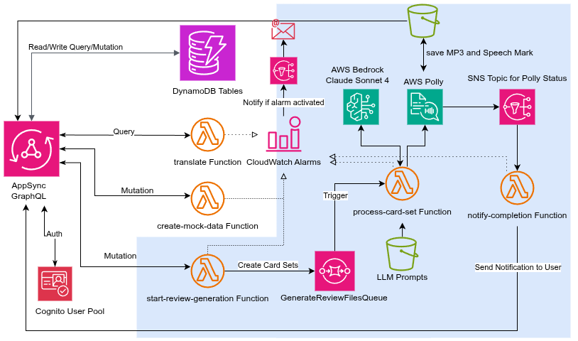

# **MemorAI \- The Audio-Based Language Learning App**

MemorAI is a Spaced Repetition System (SRS) application designed to help you master new languages through its unique, audio-focused learning experience. It transforms your daily review queue into a personalized podcast, allowing you to learn on the go—during your commute, at the gym, or whenever you can listen.

This repository contains the full-stack source code for the MemorAI application, built on Next.js and a serverless AWS backend managed by AWS Amplify Gen 2\.

### **Demos**

- **MemorAI Introduction (3-min overview):** [Watch on YouTube](https://www.youtube.com/watch?v=4CYabcWYygk)
- **UI Tutorial & Feature Walkthrough:** [Watch on YouTube](https://youtu.be/c9-9NZydUnQ)

## **The Role of AWS Lambda**

AWS Lambda is the serverless compute engine at the heart of this project, acting as the "backend brain" that runs all custom logic without needing to manage any servers. Its use is split into two main areas:

1. **Asynchronous Audio Generation:** A chain of Lambda functions orchestrates the complex, long-running task of generating audio reviews. This event-driven workflow ensures the user interface remains fast and responsive while the heavy lifting happens reliably in the background.
2. **Custom API Logic:** Lambda also powers simple, direct API queries. For example, the `translate` function in our GraphQL API is a Lambda that takes text, calls Amazon Bedrock to get a translation, and returns the result directly to the user.

### **Monitoring & Error Handling**

We send all Lambda logs to CloudWatch and create one CloudWatch alarm for each Lambda function to track the number of errors in 5-minute windows. If the number of errors exceeds 1, we send a notification email to ensure rapid response to any issues.

## **Tech Stack & Architecture**

MemorAI is built on a modern, fully serverless architecture on AWS.

- **Frontend:** Next.js, React, TypeScript, Amplify UI
- **Backend:**
  - **Framework:** AWS Amplify Gen 2, AWS CDK
  - **API:** AWS AppSync (GraphQL)
  - **Authentication:** AWS Cognito
  - **Database:** Amazon DynamoDB
  - **Compute:** AWS Lambda
  - **Messaging & Orchestration:** Amazon SQS, Amazon SNS
  - **Generative AI:** Amazon Bedrock (Anthropic Claude)
  - **Text-to-Speech:** Amazon Polly
  - **Storage:** Amazon S3

### **Architecture Diagram**

The diagram below illustrates the event-driven architecture that powers MemorAI's core features.

### **Workflow: Generating a Review File**

1. A user's request from the Next.js app to generate a review file triggers the `start-review-generation` Lambda via an AppSync mutation.
2. This function validates the request, claims the due cards in DynamoDB, and places a job message into the `GenerateReviewFilesQueue` (SQS).
3. The SQS queue triggers the `process-card-set` Lambda, which is our main workhorse.
4. This function calls the **Anthropic Claude API** directly twice: first, to generate a creative story from the card content, and second, to convert that story into a structured SSML file.
5. It then starts an asynchronous synthesis task with **Amazon Polly**, telling it to save the final MP3 and speech mark files to an S3 bucket and to publish a status update to an SNS topic upon completion.
6. The SNS topic triggers the `notify-completion` Lambda.
7. This final function updates the database record with the S3 file paths and a 'ready' status, and creates a notification that is instantly delivered to the user via the AppSync GraphQL subscription.

### **Note on AI Model Usage**

During testing with Claude Sonnet 4 on AWS Bedrock, I encountered output token limits that appeared to be account-level restrictions requiring AWS support intervention. Due to hackathon deadline constraints, I implemented the story and SSML generation tasks using the Anthropic Claude API directly while awaiting AWS support feedback. The translation function continues to use Amazon Bedrock as originally planned.

## **Prompts**

You can find all AI prompts used in this application in the `prompts` directory in the root of this repository.

## **Deployment**

This application is designed to be deployed to **AWS Amplify Hosting**, which provides a git-based CI/CD workflow.

### **Prerequisites**

1. Install the Amplify CLI: `npm install -g @aws-amplify/cli`
2. Install project dependencies: `npm install`

### **Deployment Steps**

1. **Fork this repository** to your own GitHub, GitLab, or Bitbucket account.
2. **Connect your app to Amplify Hosting.** Follow the official [**Amplify Hosting Quickstart Guide**](https://docs.amplify.aws/react/start/quickstart/). Amplify will detect the build settings for a Next.js application automatically.
3. **Configure Environment Variables (Secrets):**
   - After your application is created in the Amplify Console, navigate to **App settings \> Environment variables**.
   - Click **Manage variables**.
   - Click **Add variable**. You **must** create a secret variable with the following name and value:
     - **Variable name:** `ANTHROPIC_API_KEY`
     - **Variable value:** \[Your API key from the Anthropic platform\]
   - Save the changes.
4. **Trigger a build.** Go to your app in the Amplify Console and click **Redeploy this version** to start a new build that includes the secret environment variable.

Your application will now be live and accessible at the URL provided by Amplify Hosting.
